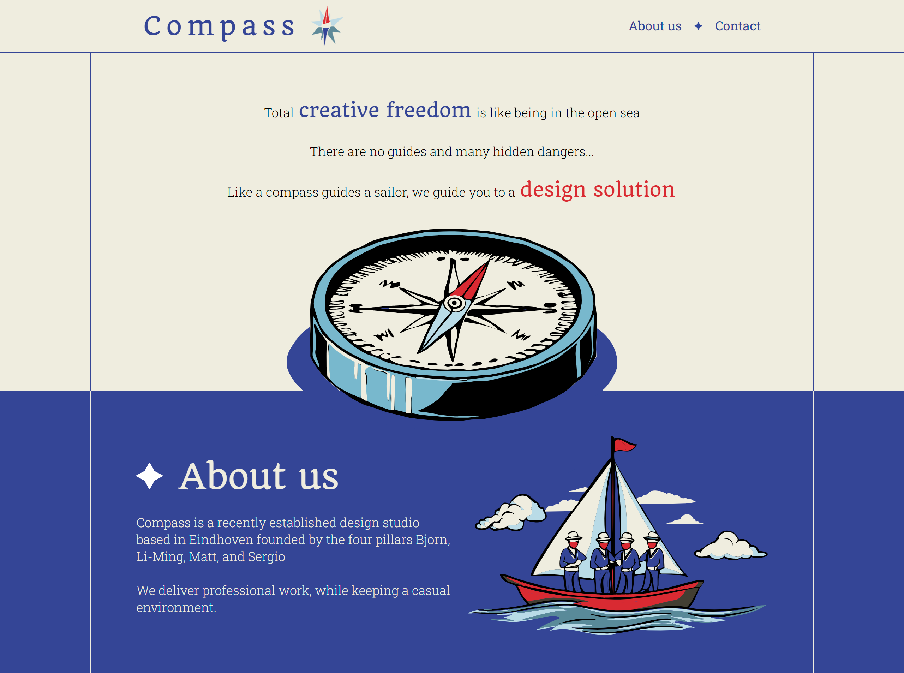

# Compass design studio website
Compass is a freelance company, which specializes in designing and developing projects for clients. We consist of four students who strive to create authentic products with the client’s vision at the center of the design. The market is always changing, and we are aware of that. Adaptability and flexibility are therefore an important aspect of our workflow. To ensure a hitch free experience we are transparent about our process and opinions. 

## Authors

- [Bjorn Verbakel](https://git.fhict.nl/I529052)
- [Li-Ming Hillman](https://git.fhict.nl/I503055)

## Screenshots

## Demo

View a demo website [here](https://i529052.hera.fontysict.net/compass/).## Color Reference

| Color             | Hex                                                                |
| ----------------- | ------------------------------------------------------------------ |
| Beige |  #f0eddf |
| Red |  #d92932 |
| Dark blue |  #334596 |
| Teal |  #598a99 |
| Blue |  #78b8cc |
| Light blue |  #badbe6 |

## Future implementations

- Contact page

- Improved responsiveness

## License

Compass © 2024 by Bjorn Verbakel, Li-Ming Hillman is licensed under CC BY-NC-ND 4.0 